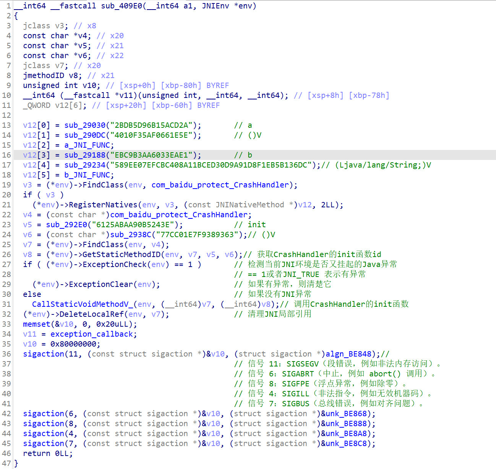
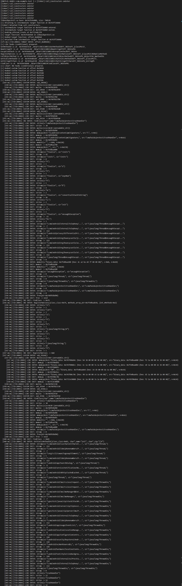

# Frida_BehaviorTrace
场景：在native层遇到一个特别复杂的函数时，比方说被vmp保护的函数，若是难以通过静态分析工具去分析它的逻辑，那可以尝试hook一些libc的函数、JNI的函数观察它的行为。ps：这个脚本就做了这么一个事情。

# 使用方法
1.根据自己的需求，修改hook时机，当前脚本的hook时机是：linker64的call_constructor执行前。

2.选定完hook时机后，调用hook_main_target_function_for_tracing()。ps：我之所以选择在执行完sub_88060再执行，是因为sub_88060会对某些函数进行解密，请大家自行修改。

3.修改目标so和目标函数————修改TARGET_MODULE_NAME和TARGET_FUNCTION_OFFSET。

4.添加要关注的自定义函数的偏移————往CUSTOM_FUNCTION_OFFSETS添加想要关注的自定义函数。

5.添加要关注的libc的函数，修改参数解析的代码————往LIBC_FUNCTIONS_TO_HOOK添加要关注的libc函数，同时修改参数解析。

6.添加要关注的JNI函数，修改参数解析部分的代码———往函数hook_libart()中添加要关注的JNI函数，同样，注意修改参数解析。

7.启动脚本————frida -U -f <包名> -l trace_behavior.js

# 使用案例

比方说，我要追踪libbaiduprotect.so的sub_409E0，追踪它的行为。

sub_409E0调用了sub_29030、sub_290DC...还调用了一些JNI函数。

在我根据使用方法修改了脚本后，执行的效果是这样的。

**缩进**代表函数调用的**层级关系**，这样子可以清晰看见目标函数执行了哪些**自定义函数、Libc、JNI函数**。

# 结语

大模型真厉害，一下子把我的思路变成代码了，哈哈哈。
